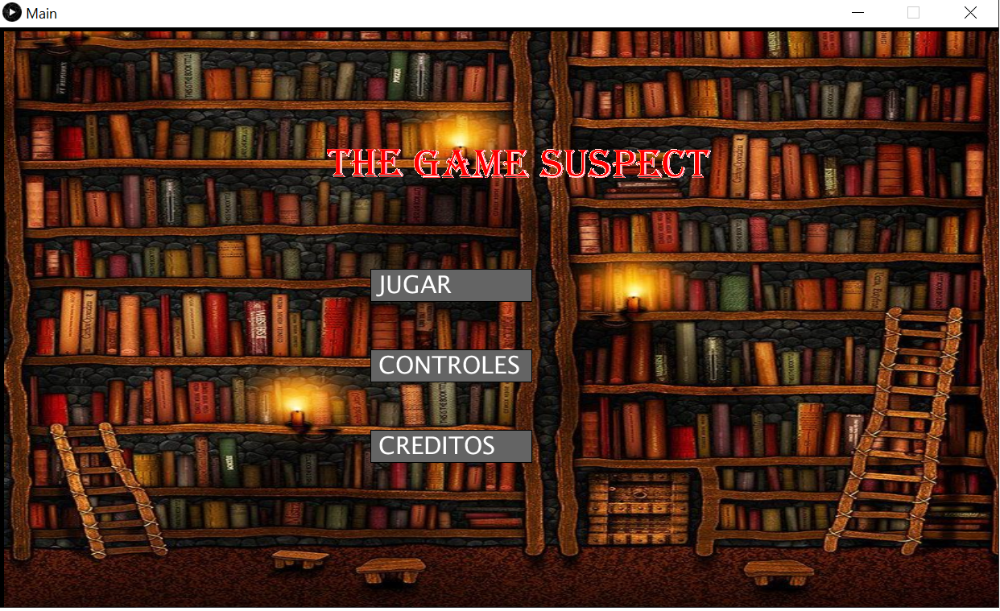
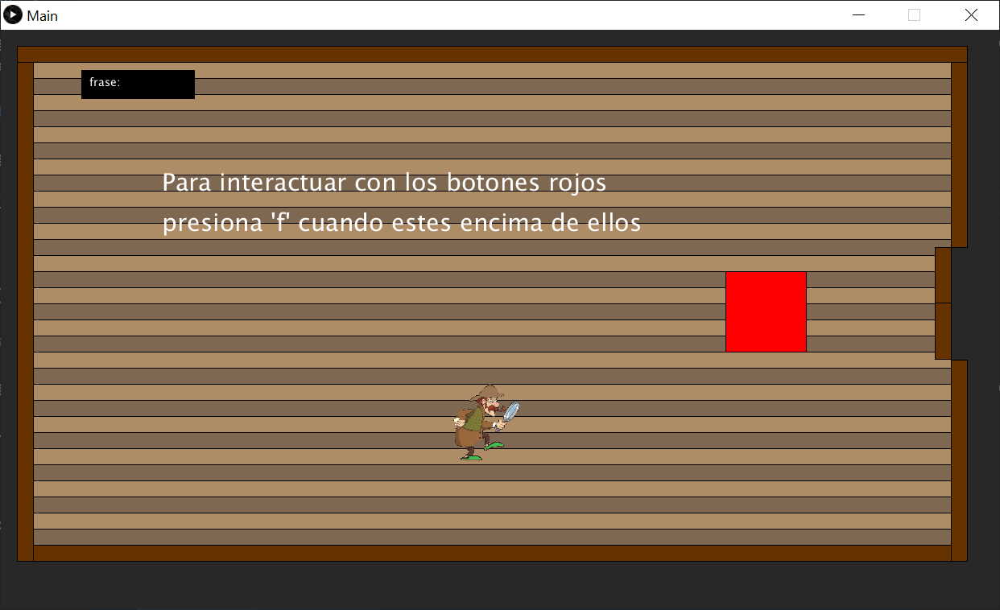

## **Título**: 	
	
THE SUSPECT

## **Hecho por**
	
Nicolas Orcasitas-2190418

Raul Andres Hincapie Hernandez-2192559

## **Descripción**: 

El jugador se encuentra encerrado en un cuarto y para poder avanzar debe resolver una pista por cada nivel del juego(cuarto) , con el fin de que al llegar al último nivel las pistas encontradas anteriormente le ayuden a resolver el último desafío para poder escapar.Si el jugador no logra completar todos los desafíos en un límite de tiempo perderá

The suspect pone en prueba la capacidad mental del jugador para resolver problemas 

## **Imágenes del Programa**: 

Inicio del juego:

[./BannerTheSuspect.jpg](./BannerTheSuspect.jpg)

Banner del juego

Menu de inicio del juego

En el juego:

Gameplay del juego

## **Características**: 

Es un juego recomendado para maypres de 10 años, ya que tiene cierto grado de complejidad matematica

The Suspect es un juego para una persona, la cual juega con el personaje de un detective que se mueve usando las teclas 'w', 'a', 's', 'd'

Cada nivel es un nuevo desafio mental que debe superar, si se equivoca en alguno de estos desfios vuelve al comienzo del juego

Ademas tiene un tiempo limite para pasar todos los niveles, sino "Game Over"

Los sonidos fueron sacados de: http://sonidosmp3gratis.com/puerta-corredera

Las canciones fueron hechas por "Robert Orcasitas Garcia"

## **Creditos**:

-Amhigo.com

-Pinterest

-Pngflow.com

-Sonidosmp3gratis.com

